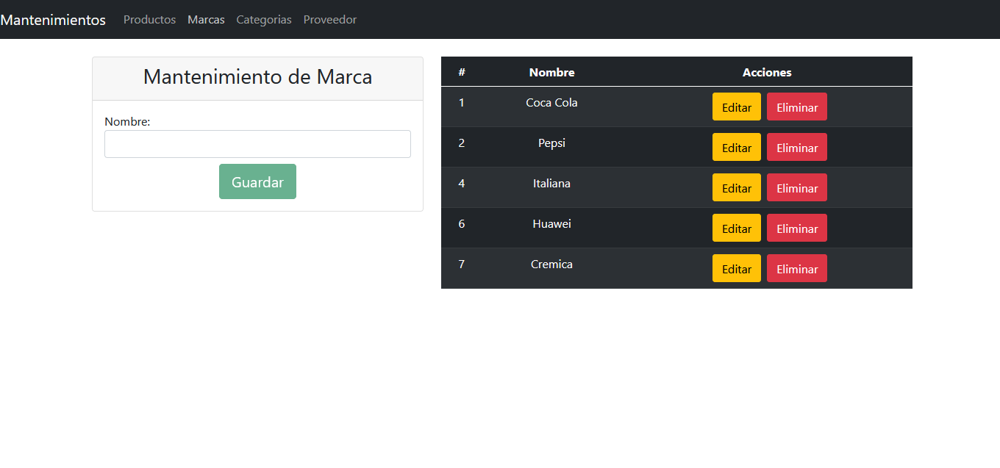
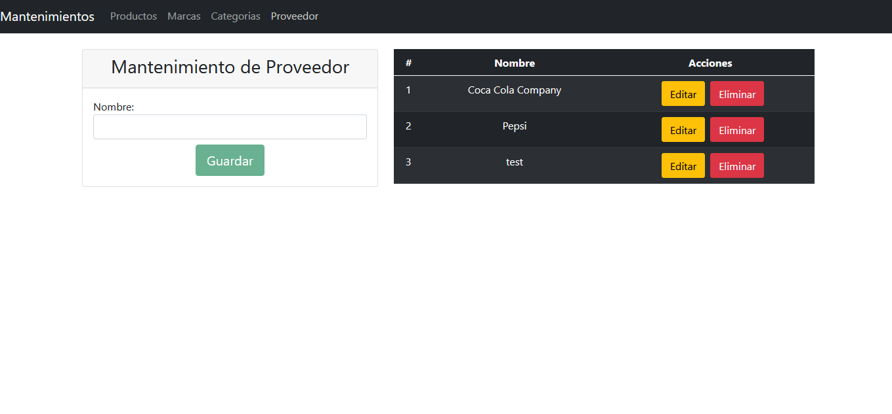

# Tienda

Proyecto de la continuacion del BackendRepository en cual se encarga de consumirlo mediante las api generadas `https://github.com/VirtualKley/BackendRepository.git`

## Development server

Run `ng serve` for a dev server. Navigate to `http://localhost:4200/`. The app will automatically reload if you change any of the source files.

## Build

Run `ng build` to build the project. The build artifacts will be stored in the `dist/` directory.

## Capturas del proyecto
## Productos Listado

## Productos Formulario

## Categorias

## Marcas

## Proveedor
